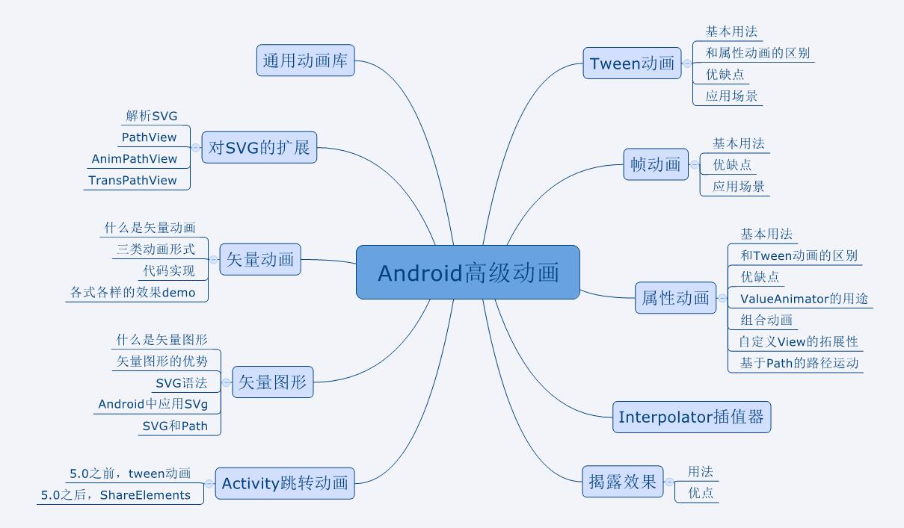

# AnimationDemo
演示动画的使用

# ---2019.7.22---
* 添加帧动画
  * 在drawable目录下添加animation-list xml文件
  * 把xml设置到布局中的imageView的src
  * 在代码中 从imageView中获取drawable强转为AnimationDrawable
  * 开启动画

# ---2019.7.22---
* 添加属性动画ValueAnimator、ObjectValueAnimator
  * ValueAnimator改变一系列的数字的变化（变化规则由Interpolator控制）通过监听数值的变化给控件的数据设置变化的值来改变控件
  * ObjectValueAnimator 继承自ValueAnimator，传入控件和要改变的属性以及一系列变化的数值，内部直接监听以及改变控件的属性值
  
# ---2019.7.22---
* 添加Tween动画(translate、alpha、scale、rotate)
  * 在src/main/res/anim文件下创建xml
  * AnimationUtil加载动画xml
  * view开启动画

# ---2019.7.22---
[跟着大佬的文章](https://www.jianshu.com/p/48554844a2db)全面学习动画相关的知识

`动画大纲`
 
